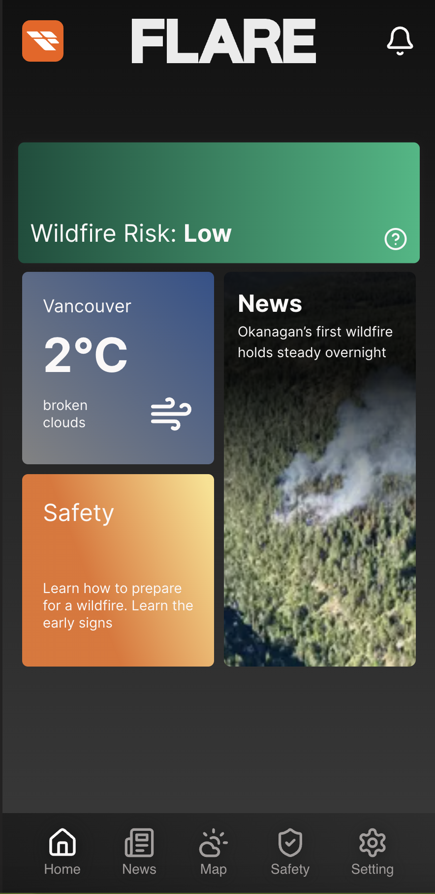

# My personal website: Terminal/OS style portfolio

## 🌐 Demo  
🔗 **Live Website:** [Go to Website](https://www.flare-bc.com/)

## 📜 Description  
Flare is a web application designed for rural communities with limited access to real-time wildfire information. Users can check wildfire locations on a map, stay updated with recent news, and assess wildfire risk levels. Built with **Next.js, React, TypeScript, and PostgreSQL,** Flare also integrates **Drizzle ORM, AWS S3, Bing News API, OpenAI API, a web crawler, and Next.js PWA** to provide accurate, reliable, and timely data while enabling installation as a progressive web app (PWA) with real-time push notifications.

### 🚀 **Planned Features**  
- Expand the availble natual disaster 
- Expand the area to all over the world

## 📸 Screenshots  

## 🛠️ Tech Stack  
- **Frontend:** Next.js, React, TypeScript, Tailwind CSS
- **Backend & Database:** PostgreSQL, Drizzle ORM
- **Cloud & APIs:** AWS S3, Bing News API, OpenAI API
- **PWA & Realtime Updates:** Next.js PWA, Push Notifications, Custom Web Crawler

